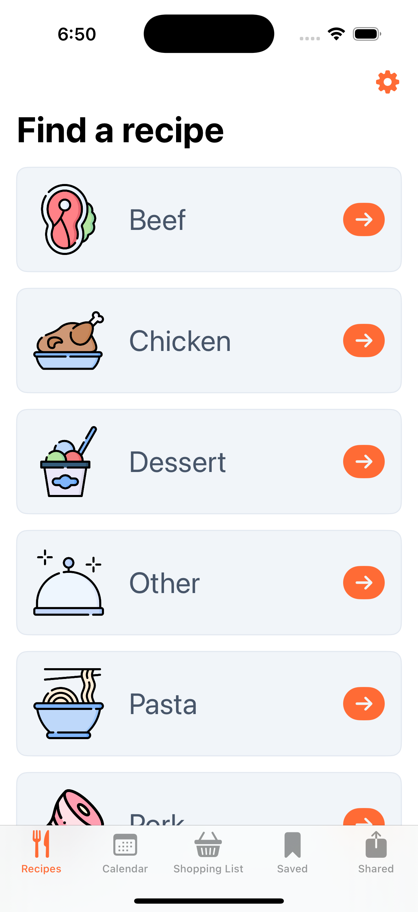
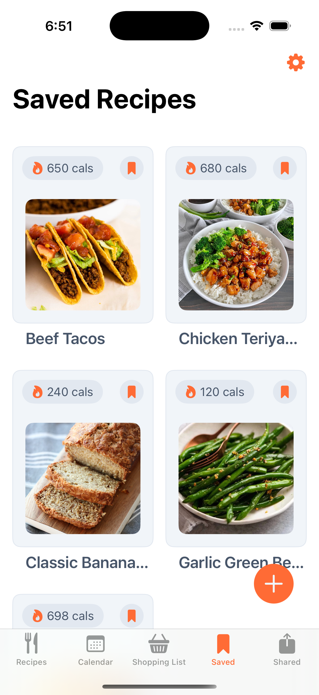
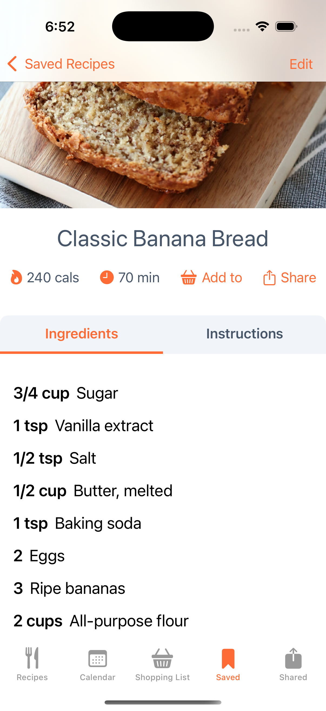
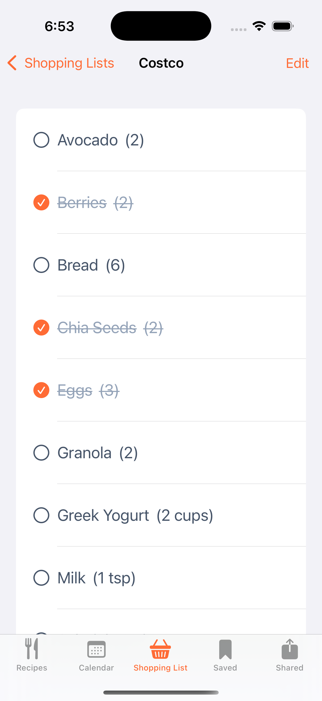
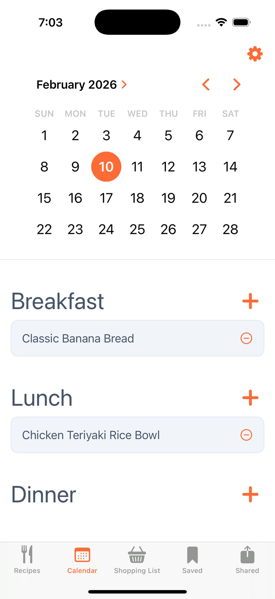

# Bitely (iOS)

Bitely is an offline-first iOS recipe app built with **SwiftUI + SwiftData**, with optional cloud sharing via a **Go + PostgreSQL** API.

Most features work entirely offline. When signed in, users can share recipes to a hosted backend and manage a shared library.

- Browse recipes by category
- View recipe details (ingredients + instructions)
- Save recipes locally for offline use (SwiftData)
- Build a shopping list from ingredients
- Plan meals using a calendar view
- Sign in to share recipes and manage your shared recipes

**Backend API repo:** [bitely-api](https://github.com/thomaslgrega/bitelyapi)
**Backend hosting:** Go API on Render, PostgreSQL on Neon

## Demo

## Tech Stack

### **iOS**
- SwiftUI
- SwiftData (offline persistence)
- async/await networking
- DTO-based networking layer (separate API models vs SwiftData models)

### **Backend**
- Go REST API
- PostgreSQL (Neon)
- JWT Authentication
- SQL migrations (managed in the backend repo)
- Hosted on Render

## App Design

### Offline-first, login optional
Most features work without an account. Local recipes and shopping lists are stored on-device.

When signed in, users can also:
- Share recipes to the backend
- View / delete their shared recipes (server-side)

## API Configuration

The app can connect to either the hosted API (recommended for demos) or a local API.

### **Hosted API (recommended)**

Set the base URL in `Networking/APIClient` to your deployed Render endpoint:
- `https://bitelyapi.onrender.com`

### **Local API**
- Simulator: `http://localhost:8080`

## Running Locally (iOS)
1. Open the project in Xcode
2. Select a simulator device
3. Run ▶︎ (To use the hosted backend, set the API base URL to your Render endpoint before running.)

## Running Locally (Backend)(optional)
See the backend repo for setup and migrations: [bitely-api](https://github.com/thomaslgrega/bitelyapi)

## Roadmap

- Sign in with Apple (in progress)
- Image upload (AWS S3 or Cloudflare R2) for shared recipes (planned)
- Pagination + improved search
